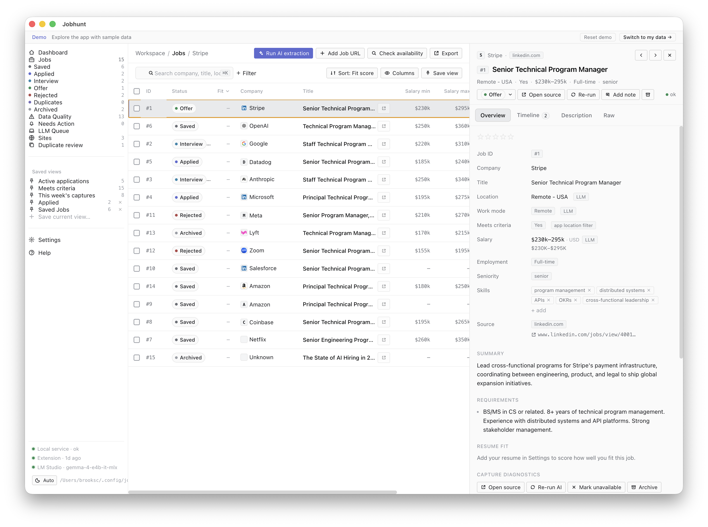

# JobHunt

**[jobhunt-app.com](https://jobhunt-app.com)** · [Mac App Store](https://apps.apple.com/us/app/jobhunt-find-your-next-job/id6782679255?mt=12) · [Issues](https://github.com/brooksc/jobhunt/issues)

Local-first job tracking. A Chrome extension captures job postings from any site; a native macOS app stores them in SwiftData, runs AI extraction, and shows a full tracking UI — all on your own machine, no cloud required.



## Overview

JobHunt is a native macOS app for job hunters. Capture postings from any job board via the Chrome extension, let the AI extract structured fields and score your resume fit, and track your pipeline from application to offer — entirely offline.

See **[docs/workflow.md](docs/workflow.md)** for the end-to-end workflow (capture → dedup → automatic AI processing → review → resolve).

There are two ways to install the Mac app:

- **DMG** — direct download from GitHub Releases; includes the MCP server integration.
- **Mac App Store** — sandboxed, so the MCP server isn't available.

Both are the same app and share nothing but the name — a DMG install and a MAS install keep **separate** local databases.

## Installation

### Mac app

**From GitHub Releases (recommended):**

1. Download the latest `Jobhunt-*.dmg` from [Releases](https://github.com/brooksc/jobhunt/releases/latest).
2. Open the DMG and drag **JobHunt** to Applications.

**From the Mac App Store:**

- [**JobHunt — Find Your Next Job**](https://apps.apple.com/us/app/jobhunt-find-your-next-job/id6782679255?mt=12) (sandboxed; MCP not available).

Requires **macOS 15.0 (Sequoia)** or later.

### Chrome extension

Install **JobHunt Capture** from the [Chrome Web Store](https://chromewebstore.google.com/detail/jobhunt-capture/jekcbebhfeidkpapienoflbcaeeknlch), open any job posting, and click the JobHunt button to capture it. The Mac app must be running; if it isn't, captures queue in the extension and sync once it's open.

## AI / LLM

Configure your AI provider in **Settings → AI Provider**. Everything can run **locally** — LM Studio on `http://127.0.0.1:1234` is recommended, so no job data ever leaves your Mac.

Supported providers:

- LM Studio (default, local) · Ollama · any OpenAI-compatible endpoint
- OpenAI · Anthropic · Google · OpenRouter
- Apple Foundation Models (macOS 26+, DMG only)

Cloud providers require your consent before any data is sent, and you're billed by that provider directly.

## MCP integration (DMG only)

The DMG build ships a `jobhunt-mcp` helper that bridges stdio JSON-RPC to the running app's HTTP
server, exposing your job database as tools for AI assistants. The app must be running, and the
Mac App Store build doesn't include it (sandbox restriction). The helper lives at
`/Applications/Jobhunt.app/Contents/Helpers/jobhunt-mcp` — every client below points at that path.

**Claude Code** —

```bash
claude mcp add jobhunt -- /Applications/Jobhunt.app/Contents/Helpers/jobhunt-mcp
```

**Claude Desktop** — Settings → Developer → Edit Config (`~/Library/Application Support/Claude/claude_desktop_config.json`):

```json
{ "mcpServers": { "jobhunt": { "command": "/Applications/Jobhunt.app/Contents/Helpers/jobhunt-mcp" } } }
```

**Codex CLI** — add to `~/.codex/config.toml`:

```toml
[mcp_servers.jobhunt]
command = "/Applications/Jobhunt.app/Contents/Helpers/jobhunt-mcp"
```

**Gemini CLI** — add to `~/.gemini/settings.json` (same shape as Claude Desktop):

```json
{ "mcpServers": { "jobhunt": { "command": "/Applications/Jobhunt.app/Contents/Helpers/jobhunt-mcp" } } }
```

Restart the client after editing so it re-reads its config. **ChatGPT desktop and the Gemini
web/desktop app** currently support only *remote* MCP connectors (a server URL), not a local command,
so JobHunt's on-device bridge can't be registered with them yet — any MCP client that accepts a local
command works. (MCP client support changes fast; check each tool's MCP docs if a key differs.)

End-user setup is also covered in the [help FAQ](https://jobhunt-app.com/help/faq).

**Trust boundary:** the MCP endpoint is local-only (`127.0.0.1`) and requires a per-device bearer token at `~/.jobhunt-mcp-token` (owner-readable only). The `job_get` tool omits raw captured page text (`selected_text`, `visible_text`) by default; pass `include_raw_text: true` to include it. Do not expose the MCP port or token to remote systems.

## Features

- **Capture from anywhere** — works on LinkedIn, Greenhouse, Lever, Ashby, iCIMS, Workday, and most job boards
- **AI extraction** — pulls salary, requirements, work mode, and more from unstructured job descriptions
- **Resume fit scoring** — ranks each job against your resume with dimension-level explanations
- **Duplicate detection** — groups identical or near-identical postings across sources
- **Availability checks** — flags saved postings that have been taken down
- **Dashboard** — pipeline progress and daily activity
- **CSV export** — export the current filtered list (⌘⇧E). This is job-list fields only, **not** a full backup — use **Settings → Back Up Data** for a complete, restorable backup of your database.
- **Offline queue** — captures queue in the extension if the app isn't running
- **MCP server** — expose your job database as tools for Claude and other AI assistants (DMG only)

## Contributing

Contributions are welcome — **including AI-assisted or AI-generated ones**. There's no separate process for them; the same quality bar applies.

To request or discuss any change — a bug, a feature, or a design question — please **[open an issue](https://github.com/brooksc/jobhunt/issues)** or **submit a pull request** first, so direction stays visible and effort isn't wasted.

Build setup, the pinned toolchain, the test gates, and the PR checklist are all in **[CONTRIBUTING.md](CONTRIBUTING.md)**.

## License

See [LICENSE](LICENSE).
